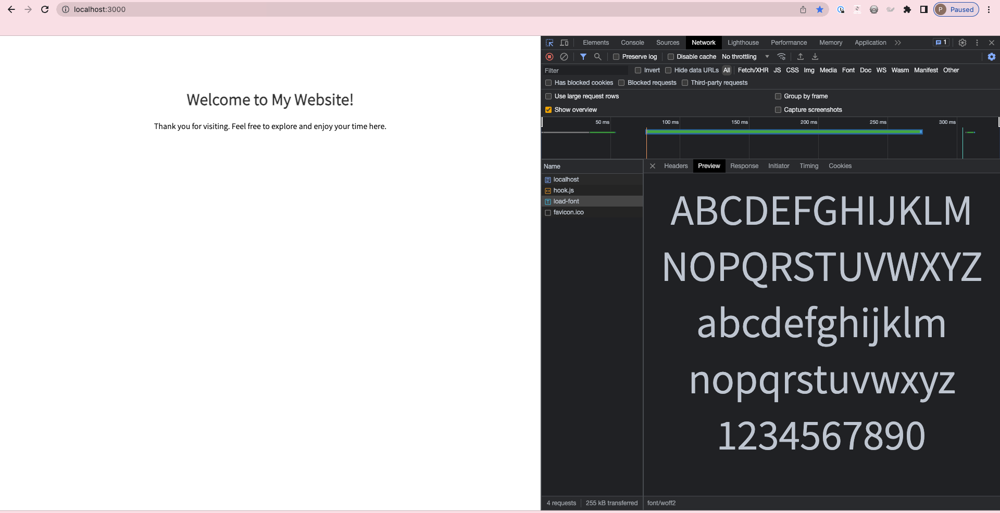

# Get fonts

## Description

`fetchfonts` is a Node.js project that demonstrates how to fetch fonts using the Express framework and the Axios library. It provides a basic server that serves font files in response to specific routes.



## Installation

To install and run the `fetchfonts` project, follow these steps:

1. Clone the repository:

   ```shell
   git clone <repository-url>
   ```

2. Change into the project directory:

   ```shell
   cd fetchfonts
   ```

3. Install the dependencies:

   ```shell
   npm install
   ```

## Usage

To start the server and fetch fonts, use the following command:

```shell
npm start
```

The server will start and listen on the default port (3000).

## Configuration

The `fetchfonts` project uses the following configuration file:

**package.json**

```json
{
  "name": "fetchfonts",
  "version": "1.0.0",
  "description": "",
  "main": "index.js",
  "scripts": {
    "start": "node server.js"
  },
  "author": "",
  "license": "ISC",
  "dependencies": {
    "axios": "^1.4.0",
    "express": "^4.18.2"
  }
}
```

## Routes

The following routes are available in the `fetchfonts` project:

- **GET /load-font**: Fetches and serves the font file.

## Dependencies

The `fetchfonts` project relies on the following dependencies:

- [Express](https://www.npmjs.com/package/express): Fast, unopinionated, minimalist web framework for Node.js.
- [Axios](https://www.npmjs.com/package/axios): Promise-based HTTP client for the browser and Node.js.

## License

This project is licensed under the ISC License. See the [LICENSE](https://opensource.org/license/isc-license-txt/) file for more information.

---

Feel free to customize this `README.md` file with additional information specific to your project.
